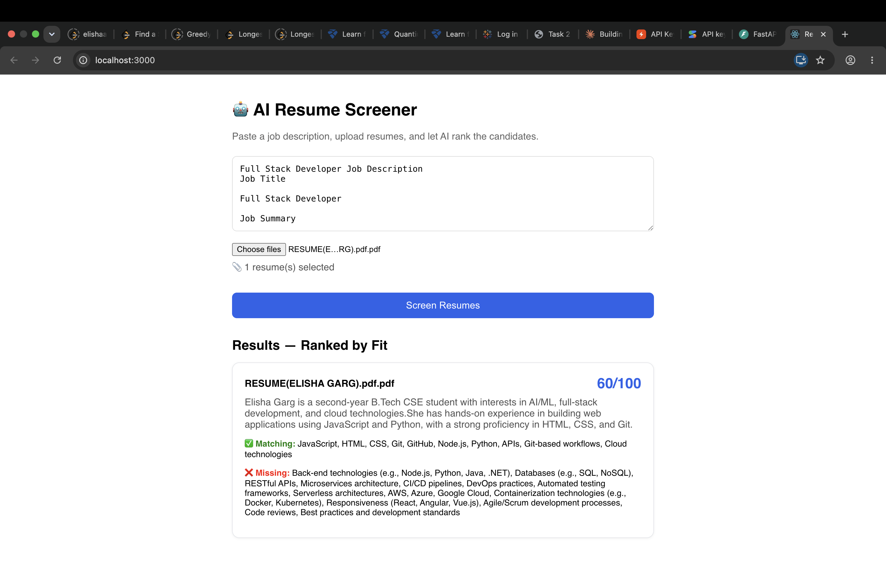

# 🤖 AI Resume Screener

A full-stack web app that uses AI to rank candidates against a job description. Upload multiple resumes, paste a JD, and get an instant ranked list with skill match analysis.

## 🚀 Live Demo
Coming soon

## ✨ Features
- Upload multiple PDF resumes at once
- AI-powered fit scoring (0-100) for each candidate
- Matching and missing skills breakdown
- 2-line AI summary per candidate
- Ranked results by fit score

## 🛠️ Tech Stack
- **Frontend:** React.js
- **Backend:** FastAPI (Python)
- **AI:** Groq API (LLaMA 3.1)
- **PDF Parsing:** pdfplumber

## ⚙️ Setup

### Backend
```bash
cd backend
python3 -m venv venv
source venv/bin/activate
pip install -r requirements.txt
```
Create a `.env` file in the backend folder:
```
GROQ_API_KEY=your_groq_api_key_here
```
```bash
uvicorn main:app --reload
```

### Frontend
```bash
cd frontend
npm install
npm start
```

Open `http://localhost:3000`

## 📸 Screenshot

